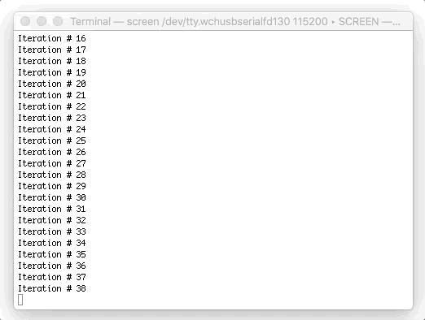

:source-highlighter: rouge
:toc:                macro
:toclevels:          2
:toc-title:

image:https://img.shields.io/github/license/pixelstuermer/python2nodemcu[link=LICENSE]
image:https://img.shields.io/github/v/release/pixelstuermer/python2nodemcu[link=https://github.com/pixelstuermer/python2nodemcu/releases/latest]
image:https://github.com/pixelstuermer/python2nodemcu/workflows/AsciiDoc%20to%20PDF/badge.svg[link=https://github.com/pixelstuermer/python2nodemcu/actions] +
image:https://img.shields.io/badge/python-3.7.4-blue[link=https://www.python.org/downloads/release/python-374]
image:https://img.shields.io/badge/platform-MacOS_(Sierra)-blue[]
image:https://img.shields.io/badge/board-NodeMcu-blue[link=https://www.nodemcu.com/index_en.html]

[discrete]
= python2nodemcu :snake:

The web is full of tutorials and documentation on how to develop Lua or C++ scripts for https://www.espressif.com/en/products/hardware[ESP microcontrollers] (and boards building on it) and flashing them with the https://www.arduino.cc/en/main/software[Arduino IDE].
But when turning away from this out-of-the-box toolset, the support is getting sparse but still available.

So things get a bit trickier when replacing the language with Python and avoiding the Arduino IDE.
IMHO, support and documentation is indeed still available but not as satisfying as expected.
I somehow found it puzzling that developing and uploading Python scripts for those controllers seems not to be that famous or at least not so well documented.

While researching and trying different things I consulted several resources because none of them was, what I would call, an end-to-end documentation.
This document therefore tries to summarize and provide the lessons I've learned from it.
Furthermore, it is an approach to get started with hacking as fast as possible, instead of entering too many technical depths.

Please see the following table of contents to get insights of the structure and subjects.
Please also note that it is based on MacOS (Sierra), https://www.python.org/downloads/release/python-374[Python 3.7.4] and the https://www.nodemcu.com/index_en.html[NodeMcu board].
Moreover, the Python packages in this tutorial will be installed using the manual fashion.
Nevertheless, there are other options to install packages, such as https://pypi.org/project/pip/[Pip].

toc::[]

== Basic Understanding

The NodeMcu board is based on the ESP8266 microcontroller and contains required components such as CPU, RAM and the TCP/IP stack (enabling WiFi network connections).
The System-on-a-chip adds several convenient features, such as more GPIO pins or a micro USB interface.
It is therefore a https://github.com/nodemcu/nodemcu-devkit-v1.0[hardware development kit] for the NodeMcu firmware.
But as just mentioned, it is also an https://github.com/nodemcu/nodemcu-firmware[open source firmware] which runs on the board by default, enabling You to program it using Lua or C++.

Commands and data are sent to the board via a device file, using the serial UART interface.
For an appropriate power supply (and for successful file uploads), please use proper USB cables and avoid USB hubs.

The development kit all in all enables You to, for example, address the GPIO pins and it hereby allows communication with connected components, such as sensors (in) and actuators (out).
Due to the low cost and easy setup it is very well suited for IoT projects.

== Prerequisites

The following sections give an overview of the requirements, before starting with developing and uploading.

=== Python

Please run one of the following commands to find out if Python 3 is already installed on Your machine:

```sh
python --version
python3 --version
```

The output should look somehow like the following:

```sh
Python 3.7.4
```

If not, please install Python 3 as described https://www.python.org/downloads/release/python-374[here].

=== Driver

Next, the appropriate SiLabs driver must be installed to enable serial USB-to-UART communication with the microcontroller.
Depending on Your operating system, please download one of these https://www.silabs.com/products/development-tools/software/usb-to-uart-bridge-vcp-drivers[drivers] and install it.
Your machine should now be able to recognize the board after connecting it via USB.

Nevertheless You won't see the device on first sight, which leads Us to the next chapter.

=== Finding the particular Device File

Device files are a concept to separate client programs from specific device drivers (which then interact with the actual devices).
So they provide interfaces to communicate with devices (which they represent), such as the microcontroller.
Hence, they can be seen as portals to the device drivers and therefore to the physical devices themselves.

They also follow the unix principle of everything being a file.
Writing data to the device file means passing data to the device driver which then sends the data to the actual physical device.

The device files are located in the `/dev` directory, but We still need to figure out which device file represents the microcontroller.
This differs according to the operating system and the installed driver.

Executing the following command will only list a subset of device files, of which one should represent the microcontroller in question:

```sh
ls -la /dev/tty.*
```

Plugging and unplugging the physical device via USB while executing the command several times should therefore result in different outputs.
Like this, the device file of the microcontroller can be easily discovered.

The result will then be similar to this:

```sh
...
/dev/tty.wchusbserialfd130
...
```

Please note that Your device file might have a different name.
Therefore, please replace `/dev/tty.wchusbserialfd130` in the following code examples with Your own device file name.

=== MicroPython Firmware

To be able to execute Python scripts on the board, the https://micropython.org[MicroPython] firmware is required.
It is an https://github.com/micropython/micropython[open source] Python compiler and runtime (adopted to run on microcontrollers) and it therefore offers an alternative to the classic Lua or C++ NodeMcu development.

The latest firmware, including for example libraries for network or GPIO pin access, can be downloaded http://micropython.org/download#esp8266[here].
Do so and save the binary on Your file system.

If You want to restore the original firmware, just have a look at https://nodemcu-build.com[this] website.
It is a cloud build service for the NodeMcu firmware, automatically building a tailored firmware for You.

== Start Hacking

After these preparations We now have an up-to-date Python version, a proper driver to communicate with the board, a firmware to execute Python scripts with and We know where to find the device file.

=== Flashing the Firmware

For flashing the NodeMcu with the MicroPython (or any other) firmware image, the Python-based command-line library https://github.com/espressif/esptool[ESPTool] will be utilized.
The latest https://github.com/espressif/esptool/releases[release] must therefore be downloaded and unzipped.

The installation can then be done with the following command:

```sh
sudo python3 setup.py install
```

Being ready to flash images by that time would be too easy, because ESPTool depends on another Python library called PySerial.
This library enables ESPTool to do serialized communication with the microcontroller device.

Hence, We first need to enable Python to access the serial UART port before actually flashing the board with any firmware image.
This is done by installing the https://github.com/pyserial/pyserial[PySerial] library.

Please download the latest https://github.com/pyserial/pyserial/releases[release], unzip it and run the following command again:

```sh
sudo python3 setup.py install
```

We are now ready to reset the flash of the microcontroller to erase its current firmware.
Please first connect the physical device via USB and then run the following command:

```sh
python3 esptool.py --port /dev/tty.wchusbserialfd130 erase_flash
```

This should lead to an output similar to this:

```sh
Serial port /dev/tty.wchusbserialfd130
Connecting....
Detecting chip type... ESP8266
Chip is ESP8266EX
...
Erasing flash (this may take a while)...
Chip erase completed successfully in 8.5s
Hard resetting via RTS pin...
```

To flash MicroPython (or any other firmware) We then execute the following command.
Keep in mind to replace the path (and name) of the binary with Your custom one (the same applies to the device file name of course):

```sh
python3 esptool.py --port /dev/tty.wchusbserialfd130 write_flash 0x00000 esp8266-20190529-v1.11.bin
```

When having trouble, the baud rate can explicitly be set using the `--baud` parameter.
This can differ according to the used cable, microcontroller, etc.

Otherwise the command results in the following output:

```sh
Serial port /dev/tty.wchusbserialfd130
Connecting....
Detecting chip type... ESP8266
Chip is ESP8266EX
...
Configuring flash size...
Auto-detected Flash size: 4MB
Flash params set to 0x0040
Compressed 617880 bytes to 402086...
Wrote 617880 bytes (402086 compressed) at 0x00000000 in 35.9 seconds (effective 137.6 kbit/s)...
Hash of data verified.

Leaving...
Hard resetting via RTS pin..
```

=== Connecting to the Board and Running Commands

Establishing a serial connection to the board is pretty straightforward on Linux and Mac and can be done using the `screen` command.
This opens an interactive MicroPython REPL prompt, with which Python commands can directly be executed on the device.

First run the following command to connect to the microcontroller with the default baud rate of `115200`:

```sh
screen /dev/tty.wchusbserialfd130 115200
```

If the device was printing any output to the console, this would now be visible.
But since We recently flashed a pure firmware image, nothing will be observable.
It might be necessary to hit `[Enter]` or `[CTRL-C]` once or twice before continuing.

For testing purposes, now simply run the following two Python commands:

```python
>>> import os
>>> os.uname()
```

This code gets executed right on the device and leads to an output like the following:

```sh
(sysname='esp8266', nodename='esp8266', release='2.2.0-dev(9422289)', version='v1.11-8-g48dcbbe60 on 2019-05-29', machine='ESP module with ESP8266')
```

Executing commands with the REPL prompt is good for testing the connection and for experimenting but definitely not for running any more complex production code.
This leads Us to the next chapter on how to develop scripts and upload files to the NodeMcu.

=== Developing Scripts

Developing Python scripts can be done using literally any text editor but a more convenient way is to use an IDE, such as https://www.jetbrains.com/idea[IntelliJ] or https://www.jetbrains.com/pycharm[PyCharm].
When using IntelliJ, the https://plugins.jetbrains.com/plugin/7322-python-community-edition[Python Community Edition] plugin is recommended to ease the development of Python scripts.
Both IDEs also support the https://plugins.jetbrains.com/plugin/9777-micropython[MicroPython] plugin (https://github.com/vlasovskikh/intellij-micropython[open source]).

For using the MicroPython plugin with IntelliJ, the following setup is required beforehand:

* Select `File > Project Structure`
** Go to `Facets`, add (`+`) MicroPython, select Your project module and click `OK`
** Then set the `Device Type` to `ESP8266` and the `Device Path` to Your device file (e.g. `/dev/tty.wchusbserialfd130`), click `Apply` and `OK`

The plugin now provides support for devices running the MicroPython firmware because it offers:

* Code completion and documentation for ESP8266 and MicroPython modules
* Uploading and executing Python files right from the IDE to the device
** Go to `Run > Edit Configurations > Add New Configuration > MicroPython`
** Now specify the script You want to upload within the `Path` field
** Click `OK` and run the configuration
** The script will now be uploaded to the device (You maybe need to restart it manually)
* Running a REPL prompt within the IDE
** Go to `Tools > MicroPython` and select `MicroPython REPL`
** Now insert Your Python commands (as already explained in the previous chapter) or view the console output

Nevertheless it does not support flashing images, such as MicroPython firmware itself.

=== Uploading Scripts to the Device

Next to this plugin, there also exists an alternative way to upload Python scripts.
The also Python-based https://github.com/scientifichackers/ampy[Ampy] library enables You to view or upload files to the MicroPython-based NodeMcu (next to https://learn.adafruit.com/micropython-basics-load-files-and-run-code/file-operations[multiple other options]).
In general, the CLI tool enables You to interact with MicroPython-based devices over its serial connection.

Download the latest https://github.com/scientifichackers/ampy/releases[release], unzip it and once again run the following command:

```sh
sudo python3 setup.py install
```

For viewing files on the NodeMcu, the CLI tool must be run with this command (assuming a baud rate of `115200` again):

```sh
python3 ampy/cli.py --port /dev/tty.wchusbserialfd130 --baud 115200 ls
```

Printing a file's content (e.g. of `main.py`) to the console is done using this command:

```sh
python3 ampy/cli.py --port /dev/tty.wchusbserialfd130 --baud 115200 get main.py
```

Nevertheless, the most interesting command is the one to upload (Python) files to the board.
Assuming You already have a Python script named `main.py`, this command will copy it to the board:

```sh
python3 ampy/cli.py --port /dev/tty.wchusbserialfd130 --baud 115200 put main.py
```

You maybe have to restart the device manually now.
But then You should be able to view the console output of the `main.py` script via the already explained `screen` command.

=== boot.py and main.py

After flashing the plain MicroPython firmware, the Ampy `ls` command will already list a file named `/boot.py`.
It represents the boot script – the file which is run right after the device is powered up or reset.

Next, MicroPython scans the root of its file system for a file named `/main.py`.
If this file exists, it will be executed after `/boot.py` has finished.
It therefore represents the place where Your main code must be placed, which will be executed after every start/restart of the device.
So once the MicroPython-based board has power, the `/main.py` will always run automatically.

== Examples

The following code examples make it easy to get in touch with Python-based scripts on the NodeMcu.

=== Counter

The first script is a plain counter, printing its iteration to the console.
The good thing about it is: No additional hardware or electrical engineering skills are required :smirk:.

```python
import time

SLEEP = 1.0
counter = 0

while True:
    counter += 1
    print("Iteration # " + str(counter))
    time.sleep(SLEEP)
```

Which obviously results in the following output:



=== LED

== Links and Resources
